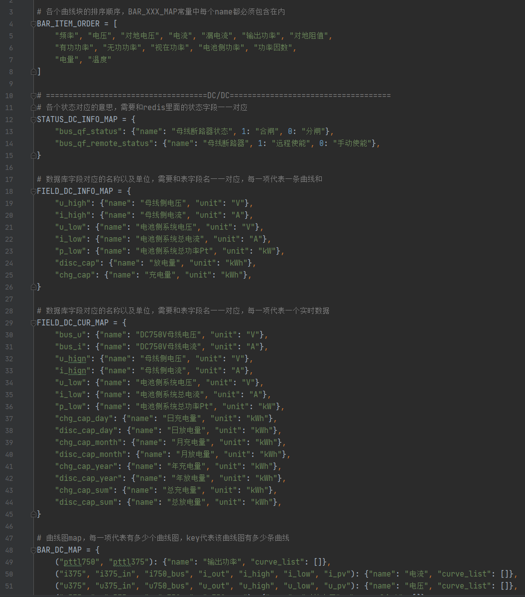
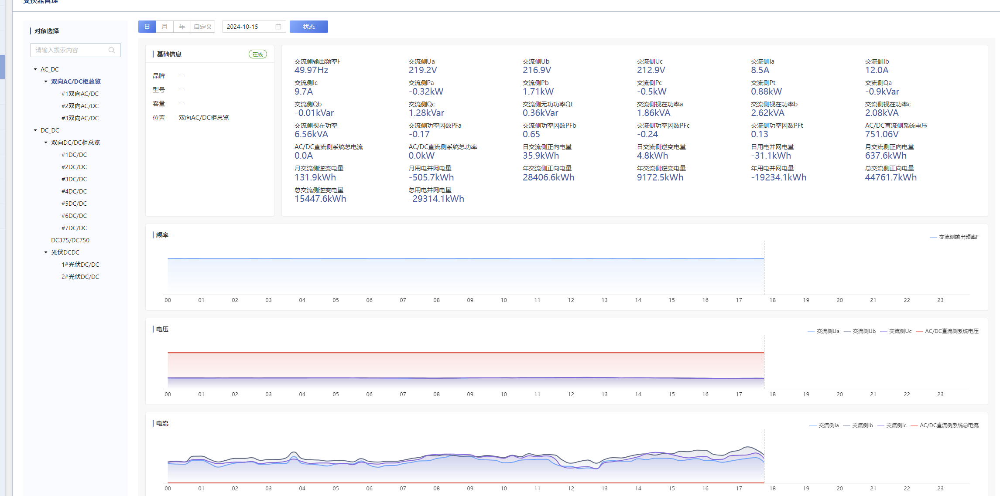

#### 自我介绍

面试官，您好，我叫pxz，是一名python开发工程师，拥有3年的开发经验。曾从事过游戏开发和web云平台开发的工作。

在过去的项目中，我负责过从项目的系统设计、数据库优化，到接口开发、代码重构等多方面的工作，目前是离职状态，在这段时间呢，我与朋友一起接了一个项目，我负责的部分呢是服务器搭建、数据库搭建、数据库设计以及后端进度把控的工作。

并且在代码规范化和团队协作上也有一定的实践。

来之前大致了解了一下咱公司的产品和业务，我觉得挺感兴趣的，个人也比较想往这方面发展，所以我就准备准备了就过来面试了。

#### celery

Celery 是一个 基于python开发的分布式异步消息任务队列，通过它可以轻松的实现任务的异步处理。

celery主要分为三个模块组成。

1. broker消息中间件：是一个任务调度队列，在celery中一般是RabitMQ或者是redis。
2. worker工作单元：任务的执行者。
3. bakend存储任务结果。

为什么要接入呢，场景：

1. 之前的这种数据处理脚本使用的是单点执行，不稳定
2. 各种脚本都在同一时间进行，堵塞程序运行

celery的使用方式比较简单，我们在使用的时候只需要再程序中配置：tasks和对应的task_queues、还有beat_schedule即可。

Celery Beat 是 Celery 的定时任务调度器，一般只部署在单台服务器上，它根据时间表去触发任务，然后将任务发送到消息队列，celery的workers再订阅到任务并且执行

#### 项目亮点/难点

Tidb压测达到30万kps，我们自己平时高峰是两百，平时大概一百多；

解决海量数据存储：

#### SQL优化

慢sql 监控发现问题->优化索引->增加冗余数据存储，减少表之间的关联，采取空间换时间的方法->颗粒度冗余point改为company的->横向拆分（分区）

#### 异步调用优化

后续开发的时候，为了减少编写数据处理脚本配置的工作量以及数据及时上传程度，系统引入了异步调度系统

当创建工厂、新增设备的时候，调用对应的数据处理脚本立刻执行一次

利用celery的send_task异步调度，结合发布订阅模式，当创建工厂时，推送消息"create_compay"，根据消息找到订阅的方法列表，执行另外一台服务器上的脚本，完成数据实时更新，以及系统解耦

#### GUI工具开发

#### 聊天系统

关于聊天系统，前期我做了一下调研，有基于Websocket的传统聊天系统和轮询的聊天系统。

由于轮询会影响服务器性能，我选择了基于Websocket的方式实现

核心逻辑如下：每个client登录都会有一个Websocket，A向B发起对话则通过调用API找到B的Websocket进行发送。而后我发现如果是群聊的话还要写一套代码，因此我将对话抽象为：A，B同时订阅了一个频道，A其实是向频道发送消息，然后由其他订阅用户接收，于是这边就产生了一个频道订阅表，频道表中只存储消息信息。但是：实时聊天需要考虑B不在线的情况，我将如何把B未收取到的信息推送给B呢？这边我想到了一个版本号的做法，每次发送消息我们都在消息后加上一个版本号，订阅表中会存储用户接收信息的版本号，这样，当用户上线的时候就能根据版本号获取未收到的信息了。

当然，这边还有优化空间，但是由于系统简单我并没有继续优化下去。

可以优化的点有：

1. 群聊中的用户以及消息过多，可能会造成性能问题，可以利用消息队列的中间件提高吞吐量
2. Websocket根据用户id标识，当系统用户过多的时候可能会对内存造成压力，首先可以考虑将不活跃的Websocket清理掉，然后需要考虑分布式的问题，可以将websocket存储到redis中
3. 安全：需要对消息进行加密

#### redis

##### 持久化方式：RDB（redis Database） AOF（append only file）

##### redis为什么快：单线程，IO多路复用

##### 缓存一致性：延时双删

##### 缓存击穿、缓存穿透、缓存雪崩

##### 哨兵模式

1. 基于主从复制实现，master节点负责写如，随后同步到子节点中，可以分担读操作的压力
2. 并发压力受限于单个服务器配置
3. 一主多从

##### redis-cluster

1. 其中的slave节点只是实现了冷备的机制，
2. 基于slot槽位的一个分片机制，实现在线扩容，提升性能
3. 多主多从

##### redis的lua脚本相关

#### 三次握手四次挥手

#### python的热更新机制

#### SSL认证

#### dns解析

#### 网络七层协议

物理层

数据链路层

传输层

网络层

会话层

表示层

应用层

#### TCP和UDP

#### 帧同步和状态同步

#### 发送请求的流程

1. 客户端发起请求

2. DNS域名解析，找到服务器IP

3. TCP连接

   - TCP3次握手建立连接

   - SSL连接

4. 发送HTTP请求

5. 服务器处理

   - 负载均衡

   - 反向代理

   - 应用层处理，服务器解析请求并进行业务处理
   - 数据库操作，和数据库交互进行读写

6. 服务器返回响应

7. 关闭连接

   - 四次挥手

8. 客户端接收响应并处理

9. 如果有必要的话客户端还会缓存结果

#### 项目碰到的难点

1. 设备数据上传失败的问题：设备上传数据路径经过很多层，首先要在tidb中查询数据，然后看时序数据库是否有数据，然后看mqtt能否接收数据，定位到问题了还要去对应的数据处理脚本中查看为什么没有数据，查看是哪里配置出错了

2. 文件上传问题：文件运行过大，文件上传速度太慢

3. 产品每次配置都要手动操作的问题：每次产品接入新工厂的时候都需要后端去手动操作数据库进行配置，经常会导致漏配置东西导致bug的问题，因此我就想能不能搞一个自动配置页面，我整合了各种设备的属性，将其分类，以及对工厂分类，当对应的工厂或者设备接入的时候，通过celery去异步调用对应的数据接入脚本即可实现自动接入（因为异步数据处理脚本是定时的，所以需要主动去调用一次，不然会有延时）

4. 需求频繁变更的问题：对于同一类型的页面，然后产品要求每个产品都要展示不同的数据项，当时开发第二个的时候我就发现了这个问题。然后结合低代码的思想，重构了这些页面的写法，改成了使用配置文件配置的方式去进行配置项。当然还存在残缺，就是后续可以考虑改为数据库配置的方式，都不需要改代码了。

   

   

5. 移动充电桩的拓扑图开发：结合  满意的效果。

#### 棋牌相关算法

#### 途游

捕鱼大作战，途游斗地主，富豪麻将，途游中国象棋

#### 文章

[redis八股文](https://blog.csdn.net/weixin_42435657/article/details/136251099#:~:text=Redis%E9%9D%A2%E8%AF%95%E5%85%AB%E8%82%A1%E6%96%87%201%201%E3%80%81%E4%BB%8B%E7%BB%8D%E4%B8%8B%20Redis%20Redis%E6%9C%89%E5%93%AA%E4%BA%9B%E6%95%B0%E6%8D%AE%E7%B1%BB%E5%9E%8B%20Redis%E5%85%A8%E7%A7%B0%EF%BC%88Remote%20Dictionary%20Server%EF%BC%89%E6%9C%AC%E8%B4%A8%E4%B8%8A%E6%98%AF%E4%B8%80%E4%B8%AAKey-Value%E7%B1%BB%E5%9E%8B%E7%9A%84%E5%86%85%E5%AD%98%E6%95%B0%E6%8D%AE%E5%BA%93%EF%BC%8C%E6%95%B4%E4%B8%AA%E6%95%B0%E6%8D%AE%E5%BA%93%E7%BB%9F%E7%BB%9F%E5%8A%A0%E8%BD%BD%E5%9C%A8%E5%86%85%E5%AD%98%E5%BD%93%E4%B8%AD%E8%BF%9B%E8%A1%8C%E6%93%8D%E4%BD%9C%EF%BC%8C%E5%AE%9A%E6%9C%9F%E9%80%9A%E8%BF%87%E5%BC%82%E6%AD%A5%E6%93%8D%E4%BD%9C%E6%8A%8A%E6%95%B0%E6%8D%AE%E5%BA%93%E6%95%B0%E6%8D%AEflush%E5%88%B0%E7%A1%AC%E7%9B%98%E4%B8%8A%E8%BF%9B%E8%A1%8C%E4%BF%9D%E5%AD%98%E3%80%82,7%207%E3%80%81Redis%E6%9C%89%E4%BA%8B%E5%8A%A1%E5%90%97%20...%208%208%E3%80%81Redis%E6%95%B0%E6%8D%AE%E5%92%8C%20MySQL%20%E6%95%B0%E6%8D%AE%E5%BA%93%E7%9A%84%E4%B8%80%E8%87%B4%E6%80%A7%E5%A6%82%E4%BD%95%E5%AE%9E%E7%8E%B0%20)

[https连接过程](https://wangjun5159.blog.csdn.net/article/details/51510594?spm=1001.2101.3001.6650.1&utm_medium=distribute.pc_relevant.none-task-blog-2%7Edefault%7EBlogCommendFromBaidu%7ERate-1-51510594-blog-108368246.235%5Ev43%5Epc_blog_bottom_relevance_base3&depth_1-utm_source=distribute.pc_relevant.none-task-blog-2%7Edefault%7EBlogCommendFromBaidu%7ERate-1-51510594-blog-108368246.235%5Ev43%5Epc_blog_bottom_relevance_base3&utm_relevant_index=2)

[计算机网络八股文](https://blog.csdn.net/m0_58042399/article/details/140991778)

[三次握手四次回收](https://blog.csdn.net/m0_56649557/article/details/119492899)

